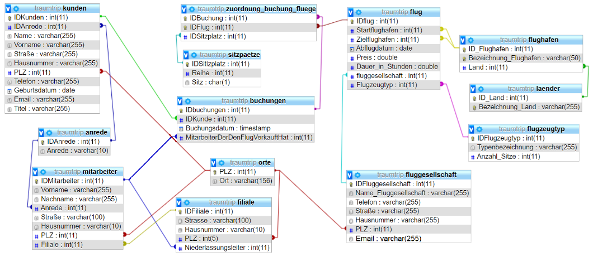

# Traumtrip Flugverwaltung

Das Reisebüro Traumtripp ist auf den Verkauf von Flugreisen spezialisiert. Dafür wurde ein EDV-System entwickelt, welches aber noch nicht ganz fertig ist. Das System besteht aus einem Frontend und einem Backend.

- Das Backend basiert auf dem `Flask` Framework und soll eine `JSON`-API Schnittstelle bieten und kümmert sich um den sicheren Zugriff auf die Datenbank.
- Das Frontend ist eine Weboberfläche mit HTML, CSS und JS, welche über die `JSON`- API mit dem Backend kommuniziert. Es verfügt über ein Dashboard `index.html` über das man zu den entsprechenden Aktionen gelangt.

## Logisches Modell der Datenbank

# Aufgaben

**Folgendes gilt für alle weiteren Aufgaben:**

Die Menüpunkte im Frontend sollen dynamisch aus der Datenbank geladen werden, das heißt wenn sich die zu Grunde liegende Tabelle in der Datenbank ändert, sollen sich das Menü automatisch mit ändern. 
Beim öffnen der Seite soll standardmäßig ein Hinweis erscheinen, dass die Daten geladen werden. Wurden die Daten erfolgreich geladen, soll diese in der Seite entsprechend angezeigt und der Hinweis: "Loading" entfernt werden. Kann keine Verbindung zum Backend aufgebaut werden oder liefert dies einen Fehler zurück, soll dies entsprechend auf der Seite angezeigt werden.

Das Backend kümmert sich den Zugriff auf die Datenbank, dazu sind alle nötigen SQL Statements in der Datei `sql_statements.py` bereits vorgegeben.

Außerdem soll das Backend alle nötigen Endpunkt, welche für die korrekte Funktionsweise des Frontends nötig sind implementieren.
Dabei sollen alle Eingaben sollen mit Hilfe von RegEx auf Plausibilität überprüft werden. Wird ein Fehler erkannt soll dieser mit einer aussagekräftigen Nachricht an das Frontend zurück gegeben werden.

## Aufgabe 1 (Flights)

Für das Frontend sollen zwei Seiten vervollständigt werden. Die Seite `flights.html` soll alle Flüge in einer Tabelle anzeigen. Die zweite Seite `add-flight.html` stellt ein Formular zur Verfügung um neue Flüge anzulegen. Implementieren Sie die benötigte Logik dazu in Javascript.

Implementieren Sie die benötigten Endpunkte im Backend entsprechend.

## Aufgabe 2 (Employees)

Für das Frontend sollen zwei Seiten vervollständigt werden. Die Seite `employees.html` soll alle Mitarbeiternamen in einer Liste anzeigen. Die zweite Seite `add-employee.html` stellt ein Formular zur Verfügung um einen neuen Mitarbeiter anzulegen. Implementieren Sie die benötigte Logik dazu in Javascript.

Implementieren Sie die benötigten Endpunkte im Backend entsprechend.

## Aufgabe 3 (Bookings)

Für das Frontend sollen zwei Seiten vervollständigt werden. Die Seite `bookings.html` soll alle Mitarbeiternamen in einer Tabelle anzeigen. Die zweite Seite `add-booking.html` stellt ein Formular zur Verfügung um einen neuen Mitarbeiter anzulegen. Implementieren Sie die benötigte Logik dazu in Javascript.

Implementieren Sie die benötigten Endpunkte im Backend entsprechend.

## Weitere Aufgaben

Implementieren Sie die fehlenden Abschnitte nach dem obigen Schema:

- Customers
- Airports
- Airlines
